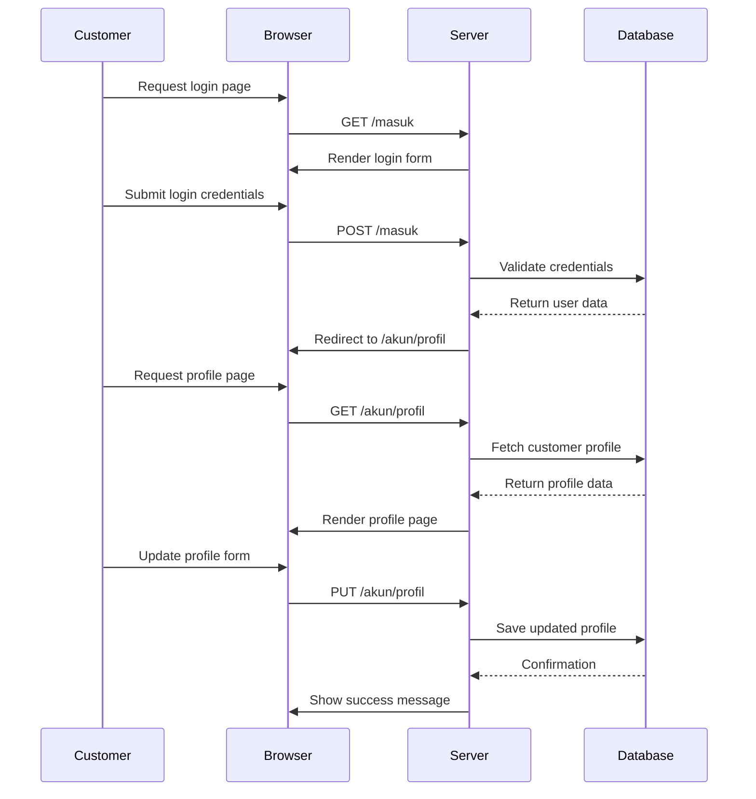
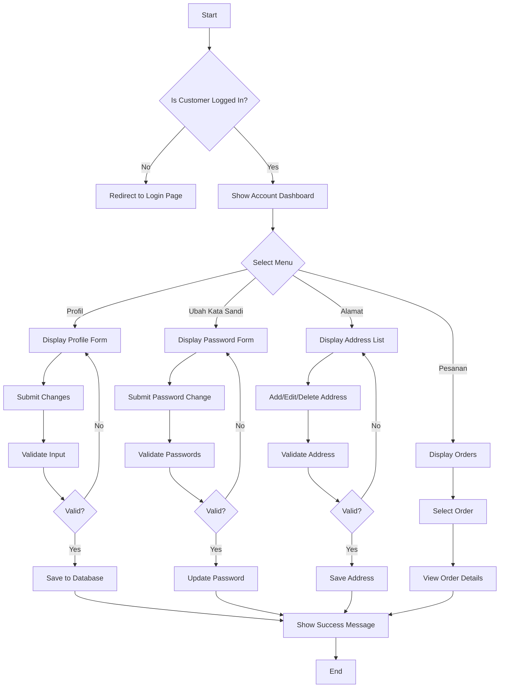

# Customer Account Manager - Tecomp99

## Overview

Customer Account Manager adalah sistem manajemen akun pelanggan yang mirip dengan Shopee, memungkinkan pelanggan untuk mengelola profil, alamat, pesanan, dan pengaturan akun mereka. Sistem ini dibangun menggunakan Laravel dengan Livewire untuk interaktivitas real-time dan Tailwind CSS untuk styling.

## 🎯 Fitur Utama

### 1. **Manajemen Profil**

-   Edit informasi pribadi (nama, email, nomor HP, jenis kelamin)
-   Upload foto profil
-   Validasi form dengan pesan dalam Bahasa Indonesia

### 2. **Manajemen Kata Sandi**

-   Ubah kata sandi dengan validasi keamanan
-   Konfirmasi kata sandi lama
-   Toggle visibility password

### 3. **Manajemen Alamat**

-   CRUD alamat lengkap dengan API wilayah Indonesia
-   Set alamat default
-   Integrasi dengan API emsifa untuk data provinsi, kabupaten, kecamatan, dan kelurahan

### 4. **Manajemen Pesanan**

-   **Pesanan Produk**: Tab navigasi berdasarkan status (Semua, Belum Bayar, Diproses, Selesai, Dibatalkan)
-   **Pesanan Servis**: Tab navigasi dengan status khusus servis
-   Detail pesanan lengkap dengan riwayat pembayaran dan pengiriman
-   Tracking garansi dan warranty

### 5. **Navigasi Terintegrasi**

-   Dropdown "Akun Saya" di topbar
-   Sidebar navigasi dengan active state
-   Mobile responsive design

## 📁 Struktur File

### **Controllers**

```
app/Http/Controllers/Customer/
├── AccountController.php          # Manajemen profil dan password
├── AddressController.php          # CRUD alamat pelanggan
└── OrderController.php            # Manajemen pesanan produk dan servis
```

### **Livewire Components**

```
app/Livewire/Customer/
└── AddressManager.php             # Komponen Livewire untuk manajemen alamat real-time
```

### **Models**

```
app/Models/
├── Customer.php                   # Model pelanggan dengan authentication
├── CustomerAddress.php            # Model alamat pelanggan
├── OrderProduct.php               # Model pesanan produk
├── OrderService.php               # Model pesanan servis
├── PaymentDetail.php              # Model detail pembayaran
├── ServiceTicket.php              # Model tiket servis
└── ServiceAction.php              # Model aksi tiket servis
```

### **Views - Layout & Components**

```
resources/views/components/
├── account-sidebar.blade.php      # Sidebar navigasi akun
├── topbar-customer.blade.php      # Topbar dengan dropdown "Akun Saya"
└── layout-customer.blade.php      # Layout utama customer
```

### **Views - Account Management**

```
resources/views/customer/account/
├── profile.blade.php              # Halaman edit profil
├── password.blade.php             # Halaman ubah kata sandi
└── addresses.blade.php            # Halaman manajemen alamat
```

### **Views - Order Management**

```
resources/views/customer/orders/
├── products.blade.php             # Daftar pesanan produk dengan tab
├── services.blade.php             # Daftar pesanan servis dengan tab
├── product-detail.blade.php       # Detail pesanan produk
└── service-detail.blade.php       # Detail pesanan servis
```

### **Views - Livewire Components**

```
resources/views/livewire/customer/
├── address-manager.blade.php      # Interface manajemen alamat
└── partials/
    └── address-form.blade.php     # Form alamat dengan dropdown wilayah
```

### **Database Migrations**

```
database/migrations/
├── 2025_05_12_015337_create_customers_table.php
├── 2025_05_23_210352_create_customer_addresses_table.php
├── 2025_05_23_070917_create_order_products_table.php
├── 2025_05_24_000000_create_order_services_table.php
├── 2025_05_24_000007_create_payment_details_table.php
├── 2025_05_24_000003_create_service_tickets_table.php
└── 2025_01_15_000000_modify_sessions_table_for_customer_auth.php
```

### **Routes**

```
routes/web.php
# Customer Authentication Routes
# Customer Account Management Routes (/akun/*)
# Customer Orders Routes (/pesanan/*)
```

## 🛠️ Teknologi yang Digunakan

### **Backend**

-   **Laravel 11**: Framework PHP utama
-   **Livewire 3**: Untuk komponen interaktif real-time
-   **MySQL**: Database utama
-   **Laravel Authentication**: Sistem autentikasi customer

### **Frontend**

-   **Tailwind CSS**: Framework CSS untuk styling
-   **Flowbite**: Komponen UI (buttons, modals, dropdowns)
-   **Font Awesome**: Icon library
-   **Alpine.js**: JavaScript framework ringan (via Livewire)

### **API Integration**

-   **Emsifa API**: API wilayah Indonesia untuk data provinsi, kabupaten, kecamatan, kelurahan
    ```
    https://www.emsifa.com/api-wilayah-indonesia/api/provinces.json
    https://www.emsifa.com/api-wilayah-indonesia/api/regencies/{province_id}.json
    https://www.emsifa.com/api-wilayah-indonesia/api/districts/{regency_id}.json
    https://www.emsifa.com/api-wilayah-indonesia/api/villages/{district_id}.json
    ```

## 🔗 URL Routes

### **Account Management**

-   `/akun/profil` - Halaman edit profil
-   `/akun/kata-sandi` - Halaman ubah kata sandi
-   `/akun/alamat` - Halaman manajemen alamat

### **Order Management**

-   `/pesanan/produk` - Daftar pesanan produk
-   `/pesanan/produk/{order}` - Detail pesanan produk
-   `/pesanan/servis` - Daftar pesanan servis
-   `/pesanan/servis/{order}` - Detail pesanan servis

## 🎨 UI/UX Features

### **Responsive Design**

-   Mobile-first approach
-   Breakpoints: sm, md, lg, xl
-   Sidebar collapse pada mobile
-   Touch-friendly interface

### **Interactive Elements**

-   Real-time form validation
-   Dynamic dropdown untuk wilayah
-   Tab navigation dengan active states
-   Modal confirmations
-   Loading states

### **Bahasa Indonesia**

-   Semua label dan pesan dalam Bahasa Indonesia
-   Format tanggal Indonesia
-   Format mata uang Rupiah
-   Pesan error dan validasi dalam Bahasa Indonesia

## 🔧 Cara Kerja Sistem

### **1. Authentication Flow**

```php
// Customer login menggunakan email atau nomor HP
Customer::findForAuth($identifier)
// Session management dengan guard 'customer'
Auth::guard('customer')->attempt($credentials)
```

### **2. Address Management dengan API**

```javascript
// Fetch provinces
fetch("https://www.emsifa.com/api-wilayah-indonesia/api/provinces.json");
// Cascade dropdown: Province → Regency → District → Village
```

### **3. Order Status Management**

```php
// Product Order Statuses
'menunggu_konfirmasi', 'diproses', 'dikemas', 'dikirim', 'selesai', 'dibatalkan'

// Service Order Statuses
'menunggu_konfirmasi', 'diproses', 'sedang_dikerjakan', 'selesai', 'dibatalkan'

// Payment Statuses
'belum_dibayar', 'down_payment', 'lunas'
```

### **4. Service Ticket System**

```php
// Service tickets dengan actions
ServiceTicket::with('actions')->where('order_service_id', $orderId)
// Actions dengan nomor urut dan deskripsi
ServiceAction::orderBy('number')->get()
```

## 🚀 Instalasi & Setup

### **1. Database Migration**

```bash
php artisan migrate
```

### **2. Seed Data (Optional)**

```bash
php artisan db:seed --class=CustomerSeeder
php artisan db:seed --class=CustomerAddressSeeder
```

### **3. Asset Compilation**

```bash
npm install
npm run build
```

### **4. Storage Link**

```bash
php artisan storage:link
```

## 🔒 Security Features

### **Authentication**

-   Password hashing dengan bcrypt
-   Session-based authentication
-   CSRF protection pada semua form
-   Email verification untuk customer baru

### **Authorization**

-   Route protection dengan middleware `auth:customer`
-   Customer hanya bisa akses data milik sendiri
-   Validasi ownership pada setiap request

### **Data Validation**

-   Server-side validation dengan Laravel Request
-   Client-side validation dengan Livewire
-   Sanitasi input untuk mencegah XSS
-   Rate limiting pada API calls

## 📱 Mobile Responsiveness

### **Breakpoints**

-   **Mobile**: < 640px (sm)
-   **Tablet**: 640px - 1024px (md, lg)
-   **Desktop**: > 1024px (xl)

### **Mobile Features**

-   Collapsible sidebar navigation
-   Touch-friendly buttons dan forms
-   Optimized spacing dan typography
-   Swipe gestures untuk tab navigation

## 🎯 Future Enhancements

### **Planned Features**

-   [ ] Notifikasi real-time
-   [ ] Rating dan review system
-   [ ] Wishlist management
-   [ ] Order tracking dengan maps
-   [ ] Chat dengan admin
-   [ ] Loyalty points system

### **Technical Improvements**

-   [ ] API rate limiting
-   [ ] Caching untuk performance
-   [ ] Progressive Web App (PWA)
-   [ ] Push notifications
-   [ ] Offline support

## 📞 Support & Maintenance

### **Logging**

-   Customer actions logged untuk audit
-   Error logging dengan Laravel Log
-   Performance monitoring

### **Monitoring**

-   Database query optimization
-   API response time monitoring
-   User experience analytics

---

**Dibuat dengan ❤️ untuk Tecomp99**  
_Customer Account Manager - Shopee-like Experience_

## 📊 Sequence Diagram



## 🏃‍♂️ Activity Diagram



    K --> Z[End]
    Server->>Browser: Show success message
